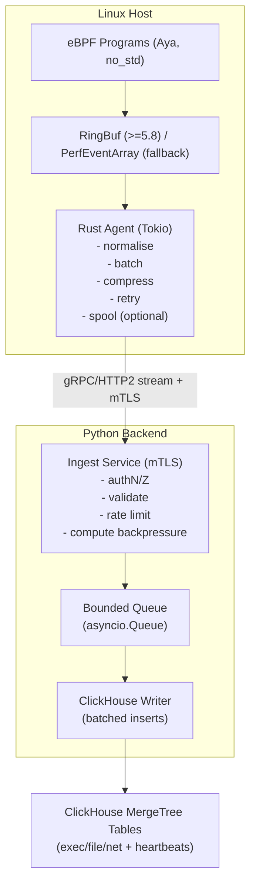
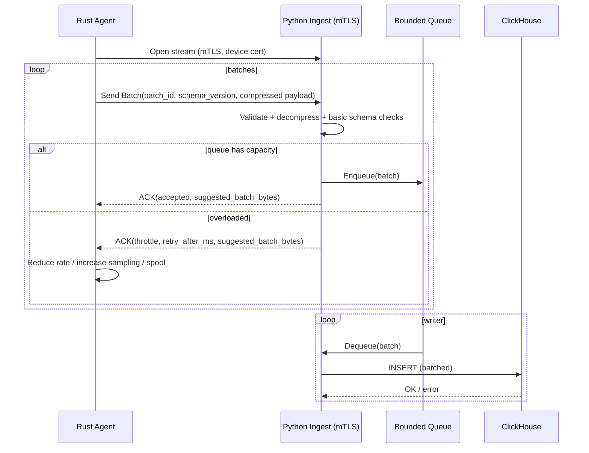

# Implementing a Rust Aya eBPF Agent with a Python Ingest Backend and ClickHouse Storage

## Executive summary

This plan describes a production-grade monitoring/telemetry system with a **low-overhead eBPF data plane** (Rust + Aya) and a **high-throughput analytics store** (ClickHouse) fronted by a **Python async ingest service**. The key design choice is to keep the **kernel-resident eBPF programs small, verifier-friendly, and allocation-free**, pushing enrichment, batching, compression, and retry logic into user space. The system uses **ring buffer delivery where available (Linux ≥ 5.8)** and falls back to **perf event buffers on older kernels** to preserve broad kernel compatibility. citeturn1search1turn0search31turn0search4

ClickHouse is modelled as a **time-partitioned MergeTree event store** (exec/file/net “families”), using **ORDER BY for query acceleration**, **time-based partitions aligned to retention TTL**, and **explicit deduplication strategy** (batch-level idempotency tokens or synchronous insert deduplication) to make retries safe. citeturn0search6turn0search2turn4search0turn4search2

A concise delivery path that scales:

- **Phase A (MVP)**: agent → Python ingest (mTLS) → ClickHouse (synchronous inserts, client-side batching).
- **Phase B (Scale-out)**: add a durable buffer (e.g. Kafka/Redpanda/NATS) between ingest and ClickHouse, and optional post-ingest normalisation/enrichment workers. This “never block on DB” pattern is explicitly recommended in the uploaded architecture notes and is the simplest way to survive bursts without losing the host or the database. fileciteturn0file0

---

## Architecture and data flow

### Components and responsibilities

**On each Linux host (agent)**  
1) **eBPF programs (Aya, `aya-bpf`, no_std)**  
- Attach to tracepoints/kprobes (and optionally cgroup hooks) and emit small, fixed-size records. citeturn0search16turn0search5turn1search0  
- Do not parse “big” payloads (paths, argv, TLS plaintext) in-kernel unless absolutely required—store hashes/truncations and let user space optionally enrich.

2) **User-space agent daemon (Rust, Tokio)**  
- Loads & attaches programs (with BTF/CO-RE portability where supported). Aya explicitly targets “compile once, run everywhere” when BTF is available. citeturn0search15turn5search9  
- Reads ringbuf/perfbuf, normalises to a stable event envelope, batches, compresses, and streams to backend with backpressure-aware queues.

**Backend (Python)**  
3) **Ingest gateway/service (async)**  
- Terminates TLS/mTLS; authenticates device identity; applies tenant routing and rate-limits.  
- Validates schema/version, decompresses, and enqueues into a bounded internal queue (never blocking the network handler on ClickHouse). fileciteturn0file0  

4) **ClickHouse writer(s)**  
- Performs large, regular inserts (batching is one of the highest leverage throughput multipliers in ClickHouse). citeturn2search0turn2search5  
- Uses either **native protocol** drivers for performance or **HTTP** for load-balancer friendliness; the official `clickhouse-connect` uses HTTP and notes the trade-off (slightly lower performance vs native protocol). citeturn0search7

### High-level flowchart



### Design constraints that drive the architecture

**eBPF safety and verifier constraints**  
- The Linux verifier enforces strong safety properties (e.g., stack initialisation, bounded memory access, termination), rejecting unsafe programs. citeturn1search0turn1search7  
- Stack space is constrained: Linux kernel docs explicitly state BPF programs are limited to **512 bytes of stack**. This strongly motivates fixed-size event structs and using maps/ringbuf reserve APIs rather than large stack buffers. citeturn6search3turn5search2

**Kernel-to-user delivery choice**  
- **BPF ring buffer** (Linux ≥ 5.8) supports efficient event delivery and provides reserve/commit semantics (avoid extra copies) plus wakeup control. citeturn1search1turn5search2turn5search8  
- **Perf event buffers** support older kernels and remain a viable fallback; Aya exposes both. citeturn0search4turn0search31

---

## Data model and ClickHouse schema

### Event envelope

Use a stable “outer” schema for transport and storage, with **versioning** for evolution:

- `schema_version` (u16): overall event schema version.
- `event_family` (enum): exec / file / net / syscall / other.
- `ts` (DateTime64): event time.
- `tenant_id`, `host_id` (strings/UUIDs): multi-tenant partitioning & filtering.
- `pid`, `tgid`, `uid`, `gid`, `comm` (low-cardinality strings/ints).
- `attrs` (Map(String,String)) for sparse key/value extensions.
- `payload` (optional bytes) for raw “future-proof” capture (e.g., length-delimited protobuf), limited by policy.

This supports **schema evolution** by:
- Adding new columns with defaults (ClickHouse can `ALTER TABLE … ADD COLUMN` without rewriting historical parts in most cases; operational cost is the metadata + later read-time defaults).
- Keeping `attrs` for “unknown” fields, and `payload` for replay into new tables when you iterate.

### Table strategy

A practical, low-friction ClickHouse layout for telemetry is **one table per high-volume family** (exec / file / net), plus a small set of operational tables (heartbeats, ingest errors). This aligns with the architecture guidance in the uploaded notes, which also recommends ClickHouse for analytics tables like `events_exec`, `events_net`, `events_file`. fileciteturn0file0

**Partitioning and ordering rules (critical for performance & retention)**  
- MergeTree docs caution: partitioning is mainly for **data management** (drop/move partitions) and can be harmful if too granular; don’t partition by client/tenant identifiers—put them early in the ORDER BY instead. citeturn0search6turn0search37  
- TTL docs recommend partitioning by the same time field (date or month) used in TTL so ClickHouse can drop entire partitions efficiently. citeturn0search2  
- TTL merges are not immediate; ClickHouse notes TTL application happens on a schedule. citeturn0search13

### ER-style schema overview (logical relationships)

ClickHouse doesn’t enforce foreign keys, but modelling relationships explicitly helps query patterns:

| Entity/Table | Primary identifier | Refers to | Relationship purpose |
|---|---|---|---|
| `hosts_dim` | `(tenant_id, host_id)` | — | Stable host metadata (kernel, agent version, labels). |
| `process_exec_events` | `event_id` | `(tenant_id, host_id)` | “Process start/exec” edges; includes parent PID for lineage. |
| `file_events` | `event_id` | `(tenant_id, host_id)` | File access edges (open/read/write/rename), optionally hashed path. |
| `net_events` | `event_id` | `(tenant_id, host_id)` | Network connect/accept/send/recv metadata (no payload by default). |
| `agent_heartbeats` | `(tenant_id, host_id, ts)` | `(tenant_id, host_id)` | Agent health + drop counters + resource usage. |
| `ingest_failures` | `failure_id` | `(tenant_id, host_id)` | Backend-side failures for audit + debugging. |

### ClickHouse schema in a single table (what to create)

| Table | Engine | PARTITION BY | ORDER BY | TTL | Notes |
|---|---|---|---|---|---|
| `process_exec_events` | `MergeTree` | `toYYYYMM(ts)` | `(tenant_id, host_id, ts, pid)` | `ts + INTERVAL 30 DAY` | Core “flight log” exec stream. |
| `file_events` | `MergeTree` | `toYYYYMM(ts)` | `(tenant_id, host_id, ts, pid)` | `ts + INTERVAL 30 DAY` | Path stored as truncated + hash by default. |
| `net_events` | `MergeTree` | `toYYYYMM(ts)` | `(tenant_id, host_id, ts, pid)` | `ts + INTERVAL 30 DAY` | Store 5-tuple + bytes/dir where available. |
| `agent_heartbeats` | `MergeTree` | `toYYYYMM(ts)` | `(tenant_id, host_id, ts)` | `ts + INTERVAL 90 DAY` | Longer retention for ops. |
| `ingest_failures` | `MergeTree` | `toYYYYMM(ts)` | `(tenant_id, ts, host_id)` | `ts + INTERVAL 14 DAY` | Debugging & SLOs. |

**Why this works:** month partitions are usually granular enough for retention management while avoiding excessive partitions, consistent with MergeTree guidance. citeturn0search6turn0search2

### Concrete DDL example (exec events)

```sql
CREATE TABLE IF NOT EXISTS process_exec_events
(
    ts              DateTime64(9, 'UTC'),
    tenant_id       String,
    host_id         String,

    event_id        UUID,
    schema_version  UInt16,

    pid             UInt32,
    tgid            UInt32,
    ppid            UInt32,
    uid             UInt32,
    gid             UInt32,

    comm            LowCardinality(String),
    filename        String,          -- executable path (may be truncated)
    argv_hash       FixedString(32),  -- e.g. hex-encoded SHA-256 (store as bytes if preferred)

    container_id    LowCardinality(Nullable(String)),
    cgroup_id       UInt64,

    attrs           Map(String, String),      -- sparse extensions
    payload         Nullable(String)          -- optional: raw proto/base64 (keep off by default)
)
ENGINE = MergeTree
PARTITION BY toYYYYMM(ts)
ORDER BY (tenant_id, host_id, ts, pid)
TTL ts + INTERVAL 30 DAY
SETTINGS index_granularity = 8192;
```

Operational notes:
- Use `LowCardinality` for repeating strings to reduce memory and improve compression for high-cardinality event streams (common in telemetry). citeturn2search1turn2search9  
- Align `PARTITION BY` to TTL time field for efficient partition drops. citeturn0search2

### Ingestion format and batching guidance (ClickHouse-side)

- ClickHouse format benchmarks and docs state **Native is the most efficient input format**, and batching is a major driver of throughput. citeturn2search0  
- Compression during transmission: ClickHouse insert strategy guidance highlights using **LZ4 for speed** and **ZSTD for higher compression ratio** when bandwidth is tighter. citeturn2search5

Practical recommendation for this architecture:
- **Agent → backend**: protobuf over gRPC (small, fast, versioned).
- **Backend → ClickHouse**: driver-managed native inserts (preferred), or HTTP inserts with JSONEachRow/RowBinary if you need pure async & easy L7 load balancing. citeturn0search7turn2search4turn2search7

---

## Agent design and Aya eBPF implementation

### Goals

- **Low overhead**: minimal per-event work in kernel; no heavy string parsing; optional sampling and filtering.
- **Verifier-friendly**: avoid deep call stacks, loops that are hard to prove bounded, and large stack allocations. The verifier’s rules are strict by design. citeturn1search0turn1search7turn6search3  
- **Cross-kernel support**: use BTF/CO-RE portability when available and degrade gracefully when not. Aya supports BTF and enables it transparently when the kernel supports it. citeturn5search9turn0search15

### Kernel ↔ user-space data path

**Preferred: Ring buffer**  
- Linux ringbuf supports reserve/commit/discard, avoiding an extra copy; `reserve()` returns `None` when full (your signal to drop and increment counters). citeturn1search1turn5search2turn5search8

**Fallback: PerfEventArray**  
- Widely supported and exposed in Aya; each CPU has its own buffer, which can be consumed concurrently. citeturn0search4turn0search0

### Minimal Aya eBPF example (tracepoint exec)

**eBPF side (`aya-bpf`, simplified)**

```rust
#![no_std]
#![no_main]

use core::mem;
use aya_ebpf::{
    bindings::task_struct,
    helpers::{bpf_get_current_pid_tgid, bpf_get_current_uid_gid, bpf_ktime_get_ns},
    macros::{map, tracepoint},
    maps::ring_buf::RingBuf,
    programs::TracePointContext,
};

#[repr(C)]
pub struct ExecEvent {
    pub ts_ns: u64,
    pub pid: u32,
    pub tgid: u32,
    pub uid: u32,
    pub gid: u32,
    pub comm: [u8; 16],      // TASK_COMM_LEN
    pub filename: [u8; 64],  // truncated; avoid large stack buffers
}

#[map(name = "EVENTS")]
static EVENTS: RingBuf = RingBuf::with_byte_size(1 << 24); // 16 MiB (tune)

#[map(name = "DROPPED")]
static mut DROPPED: aya_ebpf::maps::PerCpuArray<u64> =
    aya_ebpf::maps::PerCpuArray::with_max_entries(1, 0);

#[tracepoint(name = "syscalls_sys_enter_execve")]
pub fn on_execve(ctx: TracePointContext) -> u32 {
    // Reserve space in ringbuf (returns None if full)
    let Some(mut entry) = EVENTS.reserve::<ExecEvent>(0) else {
        unsafe {
            if let Some(c) = DROPPED.get_ptr_mut(0) {
                *c += 1;
            }
        }
        return 0;
    };

    let e = entry.as_mut_ptr();
    unsafe { (*e).ts_ns = bpf_ktime_get_ns(); }

    let pid_tgid = bpf_get_current_pid_tgid();
    unsafe {
        (*e).pid = (pid_tgid >> 32) as u32;
        (*e).tgid = pid_tgid as u32;
    }

    let uid_gid = bpf_get_current_uid_gid();
    unsafe {
        (*e).uid = (uid_gid & 0xFFFF_FFFF) as u32;
        (*e).gid = (uid_gid >> 32) as u32;
        (*e).comm = [0u8; 16];
        (*e).filename = [0u8; 64];
    }

    // NOTE: real code should use safe helper wrappers to read comm/filename
    // and always keep operations small to respect verifier constraints.
    entry.submit(0);
    0
}

aya_ebpf::macros::license!("GPL");
```

Why this shape:
- Fixed-size structs avoid dynamic sizing and keep verifier reasoning straightforward. citeturn6search3turn1search0  
- Ringbuf reserve returns `None` when full; dropping + counting is the core kernel-level backpressure signal. citeturn5search2turn5search8

### User-space agent notes (Rust + Aya)

Key Aya primitives you will use:
- `aya::EbpfLoader` / `aya::Ebpf` to load and apply relocations. citeturn3search29turn3search5  
- `aya::maps::RingBuf` or `aya::maps::PerfEventArray` depending on kernel support. citeturn5search0turn0search4turn0search31  
- Tokio-based async consumption is supported (Aya supports async usage patterns). citeturn3search13turn5search15  

**User-space structure (recommended):**
- `probe_manager`: load/attach, feature detection (ringbuf availability), graceful detach on shutdown.
- `event_reader`: N tasks reading from ringbuf/perfbuf → parse into typed Rust structs.
- `normaliser`: attach host/tenant IDs, monotonic-to-wall conversions, compute stable IDs (event_id, batch_id).
- `batcher`: bounded queue + flush by (size OR time OR count).
- `sender`: gRPC streaming client with mTLS; handles retry with exponential backoff and honours backpressure hints.

### Kernel compatibility: CO-RE/BTF and fallbacks

- Aya and modern eBPF portability generally favours “compile once run everywhere” using BTF type information when the kernel supports it. citeturn0search15turn5search9  
- When running on kernels without BTF or with missing symbols, you need graceful degradation: disable specific probes, fall back from fentry/fexit to kprobes/tracepoints, and log capability negotiation.

---

## Backend design and ingestion pipeline

### Transport: protocol, TLS, backpressure

**Protocol**: gRPC streaming over HTTP/2 is a strong fit for high-rate telemetry because it supports long-lived streams, bi-directional messaging, and efficient protobuf framing.

**Identity & TLS**: use **mutual TLS** (device certificates) so the “device identity” is cryptographically bound to the connection (no bearer tokens on endpoints). This is consistent with common eBPF agent gateway patterns described in the uploaded notes. fileciteturn0file0

**Backpressure contract** (make it explicit):
- Backend returns `ACK { accepted, rejected, retry_after_ms, suggested_batch_bytes, throttle_ratio }`.
- Agent adjusts:
  - flush interval ↑, batch size ↓
  - sampling ↑ (drop low-value events first)
  - switch to disk-spool mode if enabled

### Mermaid sequence diagram: ingest with backpressure and retries



### ClickHouse inserts: batching, formats, deduplication

**Batching**  
- ClickHouse docs and format benchmarks repeatedly underline batching as a primary throughput lever. citeturn2search0turn2search5  
Target batch envelope (starting point; tune with benchmarks):
- 50k–200k rows OR 1–8 MiB payload OR 100–500 ms flush, whichever comes first.

**Format**  
- If you can: use native-protocol client inserts; ClickHouse identifies Native as most efficient. citeturn2search0turn2search3  
- If you need HTTP + L7 load balancing in front of ClickHouse: JSONEachRow is simple; RowBinary is smaller/faster but requires strict binary encoding. citeturn0search7turn2search4turn2search7  

**Deduplication / idempotency**  
Telemetry agents retry; you must decide how duplicates are handled:

1) **ClickHouse deduplication for retry-safe inserts**  
- ClickHouse provides guidance explicitly on deduplicating inserts on retries (`insert_deduplicate`) and on ensuring consistent batches for idempotent retries. citeturn4search0turn4search2  

2) **Deduplication tokens**  
- For tighter control, ClickHouse introduced an explicit `insert_deduplication_token` mechanism (use `batch_id` as token where supported) to skip duplicates within a window. citeturn4search7turn4search20  

3) **ReplacingMergeTree** (not recommended for hot telemetry facts)  
- ReplacingMergeTree deduplicates during merges and does not guarantee immediate absence of duplicates; ClickHouse docs call out the “merges happen later” limitation. citeturn4search4turn4search1

**Recommendation for this specific system:**  
- Use **synchronous inserts** + **batch-level idempotency tokens** where feasible. Consider async inserts only after you’ve proved you need them and you have measured trade-offs; ClickHouse notes async inserts shift batching to server side but can change deduplication behaviour. citeturn0search3turn4search8turn4search5

### Concrete Python backend example (async ingestion + ClickHouse writes)

Below is a minimal, production-shaped sketch: gRPC handler enqueues into a bounded queue; a writer coroutine batches to ClickHouse.

```python
import asyncio
import gzip
import time
from dataclasses import dataclass
from typing import Any, Iterable, List, Optional

import clickhouse_connect  # official, HTTP-based citeturn0search7
import grpc
# from generated protobuf: telemetry_pb2, telemetry_pb2_grpc

@dataclass
class Batch:
    tenant_id: str
    host_id: str
    batch_id: str
    schema_version: int
    ts_recv_ns: int
    rows_exec: List[dict]
    rows_file: List[dict]
    rows_net: List[dict]

class IngestService:  # telemetry_pb2_grpc.IngestServicer
    def __init__(self, queue: asyncio.Queue):
        self._q = queue

    async def PushBatch(self, request, context):
        # 1) AuthN/Z should be enforced via mTLS identity binding
        # 2) Validate schema_version, tenant routing, size limits

        if request.compression == "gzip":
            payload = gzip.decompress(request.payload)
        else:
            payload = request.payload

        # Decode protobuf -> dict rows (placeholder)
        batch = Batch(
            tenant_id=request.tenant_id,
            host_id=request.host_id,
            batch_id=request.batch_id,
            schema_version=request.schema_version,
            ts_recv_ns=time.time_ns(),
            rows_exec=[], rows_file=[], rows_net=[],
        )

        try:
            self._q.put_nowait(batch)
            # return telemetry_pb2.Ack(accepted=True, retry_after_ms=0, suggested_batch_bytes=4_000_000)
            return {"accepted": True, "retry_after_ms": 0, "suggested_batch_bytes": 4_000_000}
        except asyncio.QueueFull:
            # backpressure response
            return {"accepted": False, "retry_after_ms": 500, "suggested_batch_bytes": 1_000_000}

async def clickhouse_writer(q: asyncio.Queue, ch_dsn: dict):
    client = clickhouse_connect.get_client(**ch_dsn)  # HTTP protocol citeturn0search7

    flush_interval_s = 0.25
    max_batches = 200
    last_flush = time.monotonic()

    pending_exec: List[dict] = []
    pending_file: List[dict] = []
    pending_net: List[dict] = []

    while True:
        timeout = max(0.0, flush_interval_s - (time.monotonic() - last_flush))
        try:
            batch: Batch = await asyncio.wait_for(q.get(), timeout=timeout)
            pending_exec.extend(batch.rows_exec)
            pending_file.extend(batch.rows_file)
            pending_net.extend(batch.rows_net)
            q.task_done()
        except asyncio.TimeoutError:
            pass

        should_flush = (
            (time.monotonic() - last_flush) >= flush_interval_s
            or (len(pending_exec) + len(pending_file) + len(pending_net)) >= 200_000
            or q.qsize() == 0 and (pending_exec or pending_file or pending_net)
        )
        if not should_flush:
            continue

        # Insert in large blocks; prefer stable column types (no Python object soup)
        if pending_exec:
            client.insert("process_exec_events", pending_exec)
            pending_exec.clear()
        if pending_file:
            client.insert("file_events", pending_file)
            pending_file.clear()
        if pending_net:
            client.insert("net_events", pending_net)
            pending_net.clear()

        last_flush = time.monotonic()
```

Operational trade-off note:
- `clickhouse-connect` is the official Python integration and uses HTTP (great for enterprise networking/load balancers but slightly lower performance than native protocol). For extreme ingest, consider native-protocol drivers and/or sharded writers. citeturn0search7turn2search0

---

## Deployment and CI/CD

### Build and packaging

**Agent build pipeline**
- Build eBPF programs with Rust’s BPF targets (e.g., `bpfel-unknown-none` for little-endian hosts).
- Embed the `.o` in the user-space agent binary (or ship alongside) and verify signatures at runtime for tamper resistance.
- Enable BTF/CO-RE portability when available; Aya supports BTF and aims to reduce per-kernel rebuild needs. citeturn5search9turn0search15

**Backend build pipeline**
- Containerise Python ingest service.
- Use a separate container/job for schema migrations (ClickHouse DDL) and apply changes in a controlled rollout.

### Systemd deployment (agent)

**Least privilege: capabilities instead of full root where possible**  
Linux capability separation for BPF has improved (e.g., CAP_PERFMON introduced in Linux 5.8). citeturn3search2turn3search8  
A practical baseline for tracing programs is commonly **CAP_BPF + CAP_PERFMON** (and CAP_NET_ADMIN only for certain network hook types). citeturn3search23turn3search2turn3search7

A hardened `systemd` unit sketch (adapt to your probe types):

```ini
[Service]
ExecStart=/usr/local/bin/telemetry-agent

# Capabilities (tune based on probe types)
AmbientCapabilities=CAP_BPF CAP_PERFMON
CapabilityBoundingSet=CAP_BPF CAP_PERFMON

# Allow locking BPF maps/buffers in memory (tune; avoid infinity if you can)
LimitMEMLOCK=infinity

# Hardening
NoNewPrivileges=true
PrivateTmp=true
ProtectSystem=strict
ProtectHome=true
RestrictAddressFamilies=AF_INET AF_INET6 AF_UNIX
RestrictNamespaces=true
LockPersonality=true
MemoryDenyWriteExecute=true
```

### Kernel compatibility checks (preflight)

Run at install/start:
- Detect basic BPF support & features (maps/programs).
- Decide ringbuf vs perfbuf based on kernel support (ringbuf is documented as introduced in Linux 5.8). citeturn1search1turn5search8  
- Verify required capabilities are present and log actionable “doctor” output.

### ClickHouse deployment

- Use MergeTree tables with **sane partitioning** (often monthly) and **ORDER BY** keyed by tenant+host+time for typical “flight log” queries. citeturn0search6turn4search29  
- Align TTL and partitioning for efficient retention. citeturn0search2turn0search21  
- Prefer compression defaults unless you have measured a regression; ClickHouse emphasises compression as a performance enabler due to reduced IO. citeturn2search1turn2search5

---

## Testing, benchmarks, and observability

### Testing plan (agent + backend + ClickHouse)

**Unit tests**
- Rust: event struct serialisation, batching logic, retry/backoff, config parsing.
- Python: schema validation, queue backpressure behaviour, ClickHouse insert adapter, decompression.
- Schema: enforce invariants with “golden event” fixtures for each `schema_version`.

**Integration tests**
- Spin up ClickHouse in CI (docker compose).
- Run backend ingest service, push synthetic batches, assert rows written and TTL/partition keys correct.
- Agent-side integration test: run in a privileged CI runner (or VM) that supports BPF; attach minimal tracepoint; ensure events arrive end-to-end.

**Verifier/loader tests**
- Keep eBPF programs small and test load/attach across a matrix of kernels (e.g., 5.4 LTS, 5.10 LTS, 5.15 LTS, 6.1 LTS, latest).  
- This matters because verifier behaviour and available helpers vary by kernel; the verifier itself is documented as strict and stateful in what it allows. citeturn1search0turn1search7

### Benchmarks to run (actionable)

**Agent microbenchmarks**
- Event cost on hot paths: measure overhead of each enabled probe (CPU cycles/event, events/sec capacity).
- Ring buffer fullness and drop rate under stress: intentionally slow user-space reader and quantify drops (from `DROPPED` counter).
- Compare ringbuf vs perfbuf (where both supported) to choose defaults on each kernel class; ringbuf is designed for efficient high-volume transfer and preserves order across CPUs. citeturn5search8turn5search11turn1search1

**Pipeline benchmarks**
- Ingest throughput: sustained rows/sec and p99 ingest latency (agent timestamp → ClickHouse commit).
- Insert batch sizing sweep: 1k, 10k, 50k, 200k rows per insert; ClickHouse docs identify batching as a major efficiency factor. citeturn2search0turn2search5  
- Format comparison (if you control it): Native vs JSONEachRow vs RowBinary; ClickHouse docs discuss format efficiency and proliferation. citeturn2search0turn2search4turn2search7

**ClickHouse query benchmarks**
- “Flight log” query patterns: by (tenant_id, host_id, time range), by pid lineage, by destination IP/port, etc.
- Validate ORDER BY effectiveness: MergeTree docs clarify that ORDER BY is what primarily improves query pruning, not partitioning. citeturn0search6turn4search29

### Observability (for the system itself)

**Agent metrics**
- `events_read_total{family}`, `events_dropped_total{family}`  
- ringbuf/perfbuf lag estimates (consumer position vs producer position where possible)
- current sampling rate, active probe set, enqueue depth, spool usage
- if using kernel BPF stats: Linux exposes a sysctl `bpf_stats_enabled` and notes enabling stats has a performance cost. citeturn3search1

**Backend metrics**
- request rate, decompression time, validation failures
- queue depth, queue wait time
- ClickHouse insert duration, rows/sec, error rate
- backpressure responses sent to agents (rate of throttling)

**Logs and tracing**
- Structured logs (JSON) with correlation: `tenant_id`, `host_id`, `batch_id`, `schema_version`.
- Distributed tracing using an entity["organization","OpenTelemetry","observability framework"] compatible exporter is a pragmatic default for correlating ingest latency across services (agent → ingest → ClickHouse). citeturn3search6

---

## Security considerations and mitigations

### Threat model (what you must assume)

- The agent loads eBPF programs: this is powerful and must be treated as privileged code execution in the kernel, albeit constrained by the verifier and capability checks. The kernel verifier exists specifically to prevent unsafe programs from loading. citeturn1search0turn3search7  
- Attackers may try to tamper with the agent, block telemetry, or exploit over-privileged deployment (e.g., full root where narrower capabilities suffice).

### Mitigations (concrete)

**Least privilege for loading/attaching**
- Prefer granular Linux capabilities (CAP_BPF + CAP_PERFMON, and CAP_NET_ADMIN only when required) rather than CAP_SYS_ADMIN. CAP_PERFMON semantics and existence are documented in `capabilities(7)`. citeturn3search2turn3search8turn3search7  
- For some probe types/kernels you may still require CAP_SYS_ADMIN; treat that as a “high risk mode” and gate by policy and deployment environment. citeturn3search0turn3search7

**Supply chain and integrity**
- Sign agent binaries and embedded eBPF objects; verify signatures before load.  
- Pin and verify dependencies; generate SBOM for agent and backend images.

**Network security**
- Use mTLS with device cert rotation, short lifetimes, and revocation on compromise.
- Enforce rate limits and maximum batch sizes per device/tenant at the ingest boundary (prevents backend DoS and ClickHouse overload). fileciteturn0file0

**Backpressure and overload safety**
- Never block the ingest request path on ClickHouse commits; buffer and respond with throttling when saturated. This is a reliability pattern explicitly called out in the uploaded notes. fileciteturn0file0  
- Ensure bounded queues everywhere (agent and backend) so overload causes controlled degradation, not memory death spirals.

**Data minimisation and privacy**
- Default to metadata over content: store hashes/truncations for long strings because kernel stack is limited and full payload capture is expensive; BPF stack limit is documented as 512 bytes, reinforcing this constraint. citeturn6search3turn6search17  
- Make “sensitive payload capture” an explicit opt-in (policy + audit), not the default.

**ClickHouse hardening**
- Separate ClickHouse users: a write-only ingest user, read-only analytics user.
- Use TLS to ClickHouse where appropriate; enforce network ACLs and isolate the cluster.
- Be cautious with dedup + materialised views; ClickHouse dedup/idempotency depends on insertion strategy, and there are documented pitfalls when dependent materialised views exist. citeturn4search5turn4search26