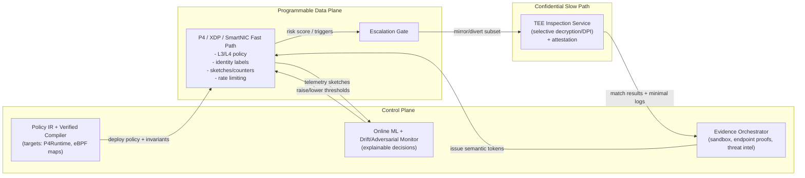

# Novel Research-Level Next-Generation Firewall Features and Architectures

## Executive summary

Next-generation firewalls are being pulled in two opposing directions: (a) they must enforce richer, context-aware security decisions (identity, application semantics, behavioural detection, data protection), while (b) **their traditional visibility is collapsing** due to modern encryption and transport changes—most notably TLS 1.3, QUIC/HTTP/3, encrypted DNS (DoH/DoQ), and the ongoing standardisation and rollout of **TLS Encrypted ClientHello (ECH)**, which specifically targets handshake metadata such as SNI that many network controls historically relied upon. citeturn2search0turn2search1turn2search2turn2search3turn3search1turn5search12turn5search3turn4search2

At the same time, the forwarding plane itself is changing. **Programmable dataplanes**—P4-programmable switches with P4Runtime control, kernel-bypass and in-kernel packet processing with eBPF/XDP and AF_XDP, and SmartNIC/DPU offloads—enable line-rate security primitives (filtering, micro-segmentation, telemetry sketches, early DDoS mitigation) but impose tight constraints on state, memory, and programmability. This is reflected in recent research on (i) security applications in P4 dataplanes, (ii) XDP/eBPF security frameworks and performance comparisons, and (iii) hardware offload pipelines derived from eBPF programs. citeturn6search0turn9search0turn0search16turn0search32turn6search2turn6search6turn9search35turn0search37turn9search31

This report proposes a set of **novel, research-grade firewall features** that treat the firewall not as a monolithic box but as a **heterogeneous security fabric**: (1) verifiable policy compilation across P4/XDP/SmartNIC targets; (2) encrypted-traffic policy using endpoint-attested, privacy-preserving “semantic labels” to replace lost SNI/DNS visibility under ECH/DoH/DoQ; (3) “probable-cause” confidential inspection (TEEs + privacy-preserving DPI) for high-risk flows only; (4) sketch-driven online ML with drift/adversarial robustness and explainability; (5) identity-graph microsegmentation integrated with orchestration (Kubernetes/SDN) and cross-host flow constraints; and (6) quarantine-and-prove enforcement loops where sandboxing and behavioural evidence progressively unlock privileges rather than granting them up-front.

A 12–24 month research roadmap is provided, with concrete prototypes to build, datasets to test on (e.g., CICIoT2023, Edge-IIoTset, TON_IoT, CSE-CIC-IDS2018), benchmark tooling, threat scenarios, and success criteria.

## Threat model and design constraints

### Threat model

The system under discussion is an enterprise NGFW/SASE-like enforcement plane deployed at one or more of: branch edges, cloud edges/PoPs, datacentre ingress/egress, and workload edges (Kubernetes nodes, service meshes). “Threat model” here includes both classical network attackers and modern constraints created by encryption and ML-driven detection.

**Adversaries and capabilities**

1. **External attackers** attempting exploitation, scanning, brute force, botnet operations, and large-scale volumetric or protocol DDoS.
2. **Malware-infected endpoints** and “living-off-the-land” behaviours: C2 over TLS/QUIC, data exfiltration in encrypted channels, covert tunnelling (notably in encrypted DNS). DoH specifically maps DNS exchanges into HTTPS, reducing traditional DNS visibility; DoQ moves DNS to QUIC, similarly encrypting and changing transport properties. citeturn2search3turn3search1
3. **Insider / compromised identity** adversaries who can authenticate but attempt lateral movement, data theft, and privilege escalation. Zero trust guidance explicitly foregrounds lateral-movement limitation and continuous policy decisions. citeturn7search0
4. **Network observer evasion** via modern privacy mechanisms:
   - TLS 1.3 encrypts most handshake and all application data. citeturn2search0  
   - QUIC carries transport semantics over UDP with integrated encryption via TLS for QUIC. citeturn2search1turn4search2turn2search2  
   - ECH aims to encrypt the ClientHello under a server key, directly reducing metadata (e.g., SNI) available to passive observers and middleboxes; ECH is now specified as an RFC, and DNS-based bootstrapping mechanisms have also been standardised. citeturn5search12turn5search3turn3search2turn5search2
5. **Adversarial ML**:
   - **Evasion**: crafting traffic to look benign under flow-based models.
   - **Poisoning**: attempting to corrupt learned models (especially relevant under federated learning).
   - **Concept drift exploitation**: inducing distributional changes so detectors decay.
   Research surveys highlight these as practical concerns for ML-based network intrusion detection. citeturn1search9turn1search13turn10search0

**Assets and security objectives**

- Confidentiality of sensitive enterprise data (DLP goals) and regulated data.
- Integrity and availability of services (DDoS resistance; avoiding false positives that cause outages).
- Enforcing least privilege and limiting lateral movement (ZTNA and microsegmentation properties). citeturn7search0turn9search1

### Hard constraints for “next-generation” designs

1. **Low latency at scale**: inline enforcement must keep p99 latency bounded while handling bursty traffic.
2. **Visibility loss** under ECH, DoH/DoQ, QUIC/HTTP3: policy cannot assume domain names and plaintext payload are observable. citeturn5search12turn2search2turn2search3turn3search1
3. **Heterogeneous dataplane constraints**:
   - P4 is designed to express packet-processing pipelines and the interface to control planes (e.g., via P4Runtime), but targets differ (“portable” behaviour is non-trivial). citeturn6search0turn9search0turn9search20
   - XDP provides early packet processing at/near the NIC driver, and AF_XDP provides a high-performance user-space path for redirected frames. citeturn6search6turn6search2
   - SmartNICs can offload network/security functions, but introduce operational and programmability challenges (surveys emphasise taxonomy and open issues). citeturn9search31
4. **Privacy and legal risk**: TLS interception and DPI can conflict with privacy expectations and regulation; privacy-preserving inspection is an active research space. citeturn10search9turn0search6turn10search29
5. **False-positive management**: especially for ML-based detection; concept drift and adversarial robustness must be first-class design goals, not afterthoughts. citeturn1search8turn1search9turn1search13

## Survey of recent research, standards, and programmable dataplanes

### Standards and protocol trends reducing firewall visibility

- **TLS 1.3** provides confidentiality and integrity protections and reduces handshake exposure compared to prior versions. citeturn2search0  
- **QUIC and HTTP/3** move core transport functions into an encrypted, UDP-based protocol stack, limiting what middleboxes can infer while changing latency and connection patterns. citeturn2search1turn4search2turn2search2  
- **Encrypted DNS**:
  - DoH defines DNS queries/responses over HTTPS. citeturn2search3  
  - DoQ defines DNS over dedicated QUIC connections. citeturn3search1  
- **ECH**:
  - The ECH mechanism encrypts the TLS ClientHello under a server public key (as an RFC). citeturn5search12  
  - Bootstrapping ECH config via DNS SVCB/HTTPS records is also specified as an RFC, building on SVCB/HTTPS record definitions and HPKE. citeturn5search3turn3search2turn5search2  
- **Privacy-enhancing HTTP**:
  - Oblivious HTTP (OHTTP) forwards encrypted HTTP messages to mitigate metadata-based client identification, with DNS-based discovery mechanisms standardised. citeturn3search3turn4search1  

Implication: “block by domain” and “inspect payload” mechanisms increasingly require either endpoint participation, organisational TLS intercept (where permitted), or inference techniques that operate on encrypted traffic features.

### Programmable dataplanes for enforcement and telemetry

**P4 + P4Runtime**

- The P4_16 specification positions P4 as a language for programming dataplane packet processing on targets including hardware and software devices, while explicitly separating dataplane from control-plane functionality. citeturn6search0  
- P4Runtime is specified as a control-plane API for controlling dataplane elements defined by a P4 program. citeturn9search0turn9search4  
- Recent security research uses P4 switch capabilities for attack mitigation and in-network security primitives, including DNS-focused DPI-like detection/mitigation and line-rate confinement of flows. citeturn0search16turn0search32  
- Systematisation and surveys in the last few years describe both the opportunities and constraints of programmable dataplanes for security functions. citeturn0search20turn0search12  

**eBPF/XDP + AF_XDP**

- Kernel documentation frames eBPF as an in-kernel facility, with extensive BPF documentation available as part of the Linux kernel docs. citeturn6search2  
- AF_XDP is documented as an address family optimised for high-performance packet processing. citeturn6search6  
- Recent work compares in-kernel XDP-based packet classification and user-space AF_XDP assisted designs, directly relevant to “fast path in kernel vs user space” firewall architectures. citeturn9search35  
- XDP is also used in real systems (e.g., capture/offload in IDS pipelines), and its performance depends on kernel/NIC support; practical documentation highlights kernel/NIC requirements for performance. citeturn6search20turn6search32  

**SmartNIC/DPU and hardware offload**

- Research demonstrates compilation and offload pathways where eBPF/XDP programs can be transformed into hardware pipelines (e.g., HLS-style generation), enabling NIC-resident security fast paths. citeturn0search37  
- SmartNIC surveys provide taxonomies of offloaded application classes including security and point to open problems (programmability, debugging, isolation, portability). citeturn9search31  
- Work on offloading XDP functionality to SmartNICs indicates active interest in pushing Linux packet processing primitives closer to hardware. citeturn9search15turn9search19  

### ML and behavioural detection under encrypted traffic

Two broad research threads are most relevant:

1. **Encrypted traffic classification via representation learning**
   - ET-BERT proposes transformer-based pretraining for encrypted traffic classification, treating traffic as sequences and improving downstream classification. citeturn1search2  
   - Recent work continues to build on pretrained transformers for encrypted traffic identification under evolving applications and encryption. citeturn1search18  

2. **Encrypted DNS misuse and detection**
   - Research on DoH exfiltration detection uses TLS fingerprints and flow-based features and explicitly studies evasion considerations. citeturn1search3  
   - Additional empirical studies analyse DoH traffic classification and feature characteristics. citeturn1search27  

**Concept drift and adversarial robustness**
- Concept drift degrades IDS models in non-stationary environments; recent work highlights drift as an explicit challenge and proposes drift-aware frameworks. citeturn1search8turn1search12turn1search16  
- Surveys in top venues highlight adversarial ML threats and defences for network intrusion detection. citeturn1search9turn1search13  

**Federated learning (FL) for IDS**
- A recent review focuses on FL applications in intrusion detection, including limitations and research directions—relevant when privacy constraints limit centralised training. citeturn10search0  
- FL under concept drift and under Byzantine/poisoning threats is an active research problem, including drift in FL settings. citeturn10search4turn10search32turn10academia40  

### Privacy-preserving inspection and confidential computing

Because DPI/TLS interception is privacy-sensitive and sometimes prohibited, research is exploring alternatives:

- Surveys summarise privacy-preserving encrypted traffic inspection approaches and their trade-offs. citeturn10search9  
- PrivBox (2025) proposes privacy-preserving DPI approaches as replacements/advances over earlier systems, reflecting ongoing progress in practical encrypted inspection. citeturn0search6  
- “Probable-cause privacy” designs for outsourced middleboxes (two-server, non-collusion structures) illustrate one line of work aimed at limiting what is exposed while still enabling inspection. citeturn10search29  
- Confidential computing is increasingly formalised as a practical security building block: a national cybersecurity agency position paper emphasises TEEs and remote attestation, explicitly scoping the trust base to enclave + hardware and excluding host OS/hypervisor/cloud operator, while acknowledging required attestation for authenticity. citeturn10search5  
- USENIX Security research explores “verifiable confidential computing as a service”, indicating the direction of attestation + verification to reduce blind trust in enclave-resident services. citeturn10search21  

## Feature taxonomy and comparison matrix

### Taxonomy of advanced firewall/SASE capability families

| Capability family | Typical mechanism | Primary threats addressed | Notes under modern encryption |
|---|---|---|---|
| L3/L4 stateful firewalling | 5-tuple rules, connection tracking, NAT | opportunistic scanning, basic exfil paths, policy segmentation | remains effective; less semantic detail |
| TLS interception | enterprise MITM, re-signing, key management | malware in TLS, DLP on web traffic | increasingly contentious; cannot “see” ECH-hidden metadata unless intercepting endpoint trust; can break some apps and has privacy/legal constraints citeturn10search9turn5search12 |
| DPI (plaintext) | signature matching, protocol parsing | known malware, exploits in known protocols | plaintext DPI usefulness declines as traffic encrypts; research shifts to privacy-preserving DPI and side-channel robustness citeturn0search6turn10search29 |
| IDS/IPS | signatures + anomaly + correlation | exploit attempts, known C2 patterns, lateral movement | NIST guidance remains baseline framing (network-based, host-based, behaviour analysis) citeturn7search1turn7search5 |
| ZTNA / Zero Trust | continuous authN/Z, contextual policies | insider/lateral movement, credential misuse | explicitly designed to reduce reliance on network location/perimeter citeturn7search0turn7search28 |
| CASB | API inline/out-of-band controls for SaaS use | shadow IT, SaaS data exposure | defined in cloud security practice; often paired with SSE/SASE offerings citeturn7search2turn7search3 |
| DLP | content inspection, classification, enforcement | regulated data exfiltration | becomes hard without decryption; pushes interest toward endpoint DLP and confidential inspection citeturn10search9turn10search5 |
| Behavioural / ML detection | flow features, time-series, representation learning | unknown threats, anomalies, encrypted traffic inference | challenged by drift/adversarial ML; thrives with strong telemetry and robust evaluation citeturn1search2turn1search9turn1search8 |
| Sandboxing / detonation | execute suspicious artefacts/streams in VM | unknown malware, polymorphic payloads | more useful when tied to endpoint or file/email gateways; inline network use is harder with encryption |
| Flow telemetry & analytics | NetFlow-like aggregates, sketches, per-flow stats | anomaly detection, retrospective hunting | strongest under encryption; can be accelerated in dataplane (P4/XDP) citeturn0search20turn9search35 |

### Comparison matrix of “existing” advanced capabilities

Latency impact and privacy impact are approximate qualitative assessments for typical deployments.

| Feature | Threat coverage | Latency impact | Deploy complexity | Privacy impact | Maturity |
|---|---|---:|---:|---:|---|
| L3/L4 stateful firewall | medium (coarse policy) | low | low | low | mature |
| TLS interception | high for web-borne threats + DLP | medium–high | high | high | mature but increasingly constrained |
| Plaintext DPI signatures | high for known patterns | medium–high | high | high | mature but waning utility |
| Flow-based IDS | medium–high | low–medium | medium | low–medium | mature |
| ML encrypted-traffic classification | medium–high (depends on model) | low–medium | high | medium | emerging/research→early products citeturn1search2turn1search18 |
| DoH/DoQ misuse detection | medium (specific tactics) | low | medium | medium | emerging citeturn1search3turn1search27 |
| ZTNA (zero trust access) | high for lateral movement | low–medium | high | medium | mature/rapidly growing citeturn7search0turn7search28 |
| CASB | high for SaaS governance | low | high | medium | mature citeturn7search2turn7search3 |
| Sandbox detonation | high for unknown malware | high (if inline) | high | medium | mature (as gateway), limited inline |
| Programmable dataplane L3/L4 enforcement (P4/XDP) | medium–high | very low | high | low | emerging→maturing citeturn0search16turn6search2turn6search6 |
| Confidential/TEE inspection | high (selective) | medium | very high | medium (improves over MITM) | research/early citeturn10search5turn0search6turn10search21 |

## Proposed research-grade features and architectures

This section proposes features that are intentionally **research-level**: they are plausible, prototypeable, and measurable, but not “commodity checkbox features”. Several proposals connect directly to gaps created by ECH/DoH/QUIC privacy mechanisms and to capabilities enabled by programmable dataplanes.

### Verifiable policy compilation across heterogeneous dataplanes

**Motivation**  
Modern enterprises increasingly run multiple enforcement planes in parallel: in-kernel (XDP), SmartNIC, P4 ToR/spine, cloud load balancers, and SASE PoPs. Policy drift and inconsistent semantics are a major risk, and manual tuning creates brittle behaviour. Research in programmable dataplane security shows high-speed mitigation is feasible at line rate, but composing these pieces into one correct policy is the hard part. citeturn0search20turn0search16turn0search37

**Threat coverage**
- Misconfiguration vulnerabilities (over-permissive rules, shadowed rules).
- Policy drift across locations/targets.
- Attackers exploiting “gaps” between enforcement points (e.g., allowed at edge, blocked in DC, or vice versa).
- Operational DoS caused by policy mistakes.

**Design sketch (data plane vs control plane)**  
Control plane:
- A high-level **policy intermediate representation (IR)** with:
  - identity primitives (workload/user/device)
  - flow predicates (5-tuple, “service class”, “risk score”)
  - obligations (“log”, “sample”, “mirror to TEE”, “rate-limit”)
- A compiler that emits target-specific programs:
  - P4 tables/actions + P4Runtime updates for P4 targets. citeturn6search0turn9search0  
  - eBPF/XDP programs + pinned maps for Linux hosts and PoPs. citeturn6search2turn6search6  
  - Optional SmartNIC pipelines (either native or via eBPF→hardware toolchains). citeturn0search37turn9search31  

Correctness layer:
- **Semantic equivalence checking** between IR and compiled targets using:
  - bounded packet-space testing (symbolic packet headers),
  - differential tests across targets (same traffic, same decisions),
  - runtime invariants (e.g., “no traffic from class X reaches Y without token Z”).

Data plane:
- Fast-path decisions (allow/deny/rate-limit) + lightweight counters/sketches.
- “Escalation” hooks to slower paths (TEE inspection, sandbox, or software IDS) only when required.

**Required telemetry/signals**
- Rule hit counters (per target).
- Sampled packet headers + decision trace IDs.
- Configuration version IDs and deployment status (P4Runtime/eBPF object hashes).
- Cross-plane “decision parity” telemetry: % of sampled packets with inconsistent outcomes across enforcement points.

**Performance and security trade-offs**
- Extra compilation/verification work and pipeline complexity.
- Benefits: fewer incidents due to policy errors; safer rapid updates; clearer auditability.
- Key research question: how to scale equivalence checks without exploding state space, especially with stateful rules.

**Feasibility**
- Software-only prototype is feasible using P4Runtime software targets and XDP on Linux.
- Hardware feasibility depends on target capabilities and how much state/telemetry can fit in P4 or SmartNIC memory.

**Evaluation metrics**
- Policy correctness: disagreement rate between targets under identical input traces.
- Update latency: time from IR change to consistent enforcement across all targets.
- Dataplane impact: throughput, p99 latency, and CPU utilisation for XDP path.
- Safety: number of “unsafe” policies rejected pre-deploy by verifier checks.

**Experimental plan**
- Implement a minimal IR and compile to:
  - P4 pipeline (BMv2 or hardware target) via P4Runtime. citeturn9search0  
  - XDP program (native mode where possible). citeturn6search2turn6search32  
- Replay common traffic mixes and policy changes; measure parity and update times.
- Stress with adversarial rule updates (e.g., conflicting shadow rules) to validate rejection and explanation quality.

### Encrypted-traffic policy via endpoint-attested semantic labels

**Motivation**  
ECH significantly reduces passive domain visibility by encrypting sensitive parts of the TLS ClientHello. DoH/DoQ encrypt DNS, and OHTTP can reduce linkability of requests. Together, these trends mean a network firewall often cannot reliably answer: “Which domain/app is this flow for?” without interception. citeturn5search12turn2search3turn3search1turn3search3

**Core idea**  
Shift from “network guesses application semantics” to “endpoint proves critical semantics” using privacy-preserving, attestable tokens.

**Threat coverage**
- Malware C2 over TLS/QUIC.
- Data exfiltration via encrypted DNS or QUIC-based channels.
- Policy circumvention by hiding SNI/DNS metadata.

**Design sketch**
Data plane:
- Treat flows as belonging to a **policy class** determined by a signed token presented early in flow establishment (or attached via an out-of-band channel):  
  `token = Sign(attested_endpoint_key, {dest_service_class, process_identity, purpose, expiry, nonce})`
- Enforcement actions can be class-based: allow, rate-limit, block, or “escalate”.

Control plane:
- Issue policies as “what tokens are acceptable for what destinations”.
- Maintain trust anchors (enterprise device identity, attestation keys).
- Integrate with ZTNA principles: continuous re-evaluation and least privilege. citeturn7search0turn7search28  

Privacy layer:
- Token design minimises disclosure: reveal only a coarse category (“approved SaaS”, “unknown external”, “payment”, “developer tooling”), not the exact domain, unless explicitly required.
- Optional unlinkability mechanisms can draw from OHTTP-style relay models conceptually, but adapted for security semantics rather than pure anonymity. citeturn3search3turn4search1  

**Required telemetry/signals**
- Endpoint attestation state and device posture (managed/unmanaged, patch level).
- Process identity (signed binary hash, workload identity).
- Token validation events, token failure reasons, and fallback behaviour counts.

**Performance/security trade-offs**
- Requires endpoint coverage and secure key storage; compromised endpoints can lie.
- Tightens security by enabling policy enforcement even when network metadata is hidden.
- Research tension: balancing privacy (minimal disclosure) with enforceability and incident response.

**Feasibility**
- Plausible in enterprises already running endpoint agents / MDM.
- Hardware/software: mostly software; dataplane only needs fast token validation (which may be stateful if per-flow).

**Evaluation metrics**
- Coverage: % of flows with valid tokens; % of policy decisions relying on tokens vs inference.
- Security: reduction in successful “ECH/DoH blind spot” policy bypass in red-team exercises.
- Privacy leakage: mutual information between tokens and true destination categories under an attacker model.
- Operational: token issuance latency and failure rates.

**Experimental plan**
- Use a controlled lab with ECH/DoH/DoQ-enabled clients and services; ensure the network observer cannot see SNI/DNS normally. citeturn5search12turn3search1turn2search3  
- Generate benign and malicious traffic classes; measure classification and enforcement outcomes with and without tokens.
- Include attack scenarios: token replay attempts, token stripping, compromised endpoint issuing “benign” tokens for forbidden flows.

### Probable-cause confidential inspection with TEEs and privacy-preserving DPI

**Motivation**  
Organisations often want the detection power of DPI and DLP but face privacy/legal and operational constraints. Research on privacy-preserving encrypted traffic inspection aims to reduce exposure while retaining detection ability, including “probable cause” approaches where inspection is narrower or conditional. citeturn10search9turn10search29turn0search6

**Threat coverage**
- High-confidence detection of known-bad payloads and sensitive-data exfiltration events (when enabled).
- Targeted inspection for high-risk flows flagged by fast-path heuristics.

**Design sketch**
Data plane:
- Default: do not decrypt. Perform lightweight classification and risk scoring.
- Trigger: when risk exceeds a threshold, mirror or divert the flow (or a subset) to a confidential inspection path.

Control plane:
- A decision service selects “probable cause” triggers:
  - risky destination class, anomalous transfer volume, suspicious handshake fingerprints, unusual process identity.
- Key management and policy gating: which traffic may be decrypted, by whom, and for what purpose.

Confidential inspection plane:
- Run inspection logic in a **TEE** with attestation so operators can verify what code/rules are running.
- A national agency position paper frames confidential computing as isolating computation in a TEE plus requiring remote attestation to verify integrity/state. citeturn10search5  
- Research progresses toward verifiable confidential computing frameworks, supporting the idea that enclave-resident inspection services can be verified rather than blindly trusted. citeturn10search21  
- For outsourced or multi-party situations, privacy-preserving packet inspection designs using non-collusion or limited disclosure provide additional design patterns. citeturn10search29  

**Required telemetry/signals**
- Risk triggers (from fast path): flow sketches, anomaly scores, “unknown token” counts.
- Enclave attestation results and measurement hashes.
- Inspection audit logs with strict minimisation (store only match events, not full payloads unless policy allows).

**Performance/security trade-offs**
- TEEs incur overhead and have a history of side-channel concerns; the trusted computing base must be tightly scoped.
- Selective activation (“only when needed”) is critical to maintain low latency and control cost.
- Inspection becomes policy-driven and auditable, but complexity increases substantially.

**Feasibility**
- Medium: feasible with software TEEs and modern server hardware in a lab; production depends on hardware availability, side-channel mitigations, and governance.
- Best suited initially to “high-value” traffic categories rather than blanket inspection.

**Evaluation metrics**
- Latency overhead for triggered flows (p50/p95/p99).
- Detection lift: delta in true positive rate for payload-based threats vs flow-only.
- Privacy: amount of plaintext exposure per GB of traffic (and how it concentrates on suspicious flows).
- Attestation reliability: % of successful attestation, mean time to re-attest after updates.

**Experimental plan**
- Build a prototype chain: XDP/P4 fast-path risk scoring → enclave-based inspection service.
- Use encrypted-traffic datasets and synthetic payload injection in controlled traffic; quantify how much traffic is decrypted to achieve a target detection level.
- Include adversary tests: evasion attempts that stay under thresholds, privacy attacks attempting to force decryption of benign flows (resource exhaustion / “privacy DoS”).

### Dataplane sketches + online drift-robust and adversarially robust ML detection

**Motivation**  
Encrypted traffic pushes detection toward flow statistics and behavioural signals. Pretrained models (e.g., ET-BERT) show promise for encrypted traffic classification, but production environments are non-stationary. Concept drift and adversarial attacks degrade static ML detectors, motivating online and robust learning. citeturn1search2turn1search8turn1search9turn1search13

**Threat coverage**
- Low-and-slow scans, anomalous lateral movement, DDoS precursors.
- DoH tunnelling/exfiltration patterns and suspicious encrypted DNS usage. citeturn1search3turn1search27  
- Emerging or previously unseen traffic families where signatures are weak.

**Design sketch**
Data plane (P4/XDP/SmartNIC):
- Compute streaming features at line rate:
  - per-5-tuple counters (bytes, packets, bursts),
  - quantised inter-arrival histograms,
  - sketch structures for heavy hitters and cardinality (e.g., count-min sketch, HyperLogLog-like summaries),
  - transport fingerprints (carefully, as encryption evolves).
- Export only sketches and aggregates, not payload.

Control plane:
- Online learning pipeline:
  - drift detection module,
  - model update strategy (sliding window, incremental learners, or periodic re-train),
  - adversarial robustness layer: adversarial training, detection of test-time distribution shifts.
- Explainability layer:
  - feature attribution (“why was this flow blocked?”),
  - counterfactual reporting (“would have passed if X were lower by Y”).

**Required telemetry/signals**
- Aggregated flow features and sketches from dataplane.
- Labels/feedback signals:
  - incident response labels,
  - sandbox verdicts, endpoint alerts,
  - delayed ground truth from threat intel/hunt outcomes.

**Performance/security trade-offs**
- Dataplane memory and compute are limited; sketches approximate reality.
- More telemetry improves detection but increases privacy risk and bandwidth use.
- Robustness methods often add compute and may affect latency of decisions; careful separation of fast-path blocking vs slow-path scoring is needed.

**Feasibility**
- High for prototypes: sketches and aggregates are a natural fit for P4/XDP pipelines.
- The most challenging part is human-in-the-loop labelling and drift governance.

**Evaluation metrics**
- Detection quality: ROC-AUC, precision/recall at operational points; time-to-detect.
- Drift robustness: performance over time-series evaluation rather than random train/test splits.
- Adversarial robustness: performance under constrained evasion (traffic shaping within realistic constraints).
- Cost: CPU/GPU cost, telemetry export bandwidth, dataplane memory footprint.

**Experimental plan**
- Datasets:
  - CICIoT2023 (many attack classes in IoT topology). citeturn11search0turn11search16  
  - Edge-IIoTset (supports centralised and federated learning modes; realistic IIoT testbed). citeturn11search17turn11search33  
  - TON_IoT (Industry 4.0/IoT focus; validated in research). citeturn11search2turn11search14  
  - CSE-CIC-IDS2018 (large-scale scenarios; multiple attack types). citeturn11search7turn11search31  
- Traffic generators:
  - replay datasets via tcpreplay-style pipelines,
  - high-rate generators (e.g., TRex/MoonGen-class) for throughput testing (choice depends on lab).  
- Attack scenarios:
  - DoH tunnelling/exfil patterns (modelled after published DoH exfil detection settings). citeturn1search3  
  - scanning + lateral movement sequences,
  - “drift” phases: rolling updates of benign app mixes, new TLS/QUIC versions, changed user behaviour.

### Orchestration-integrated identity graph microsegmentation with cross-host flow constraints

**Motivation**  
Workloads are dynamic; IP-based rules are brittle. Kubernetes formalises L3/L4 NetworkPolicies to constrain pod traffic, but enforcement depends on the network plugin. citeturn9search1turn9search5  
eBPF-based datapaths (e.g., Cilium) show how kernel hooks can implement higher-level networking constructs and identity-based policies (including service account identity). citeturn9search2turn9search6  
Recent programmable-dataplane security research also investigates constraining end-to-end information flows to prevent cross-host attacks. citeturn0search32

**Threat coverage**
- Lateral movement inside clusters and hybrid networks.
- Identity spoofing via IP reuse or misrouting.
- Cross-host attacks exploiting weak segmentation.

**Design sketch**
Data plane:
- Enforce microsegmentation using *workload identity* rather than IP:
  - map identities to dataplane labels (security IDs),
  - enforce allowlists on ingress/egress at multiple points:
    - node edge (XDP),
    - ToR/spine (P4),
    - optionally SmartNIC (offload).
- Incorporate cross-host constraints inspired by flow confinement work: policies can specify allowed “paths” or “waypoints” for sensitive flows (service chaining / inspection points). citeturn0search32  

Control plane:
- Subscribe to orchestration events (pod/service account changes, namespace labels).
- Compile and distribute updates to dataplane targets rapidly.
- Provide conflict detection and policy explanation.

**Required telemetry/signals**
- Kubernetes identity signals (service accounts, namespaces, labels) and policy objects. citeturn9search1turn9search6  
- Connectivity graph telemetry: allowed/denied edges, attempted violations, and time-to-propagate policy changes.

**Performance/security trade-offs**
- Identity mapping tables must be kept small and current; update storms are possible during scale events.
- Multi-tier enforcement improves security but complicates debugging.
- The research challenge is consistent semantics and fast convergence during churn.

**Feasibility**
- High: can prototype on Kubernetes with eBPF datapath hooks and optionally P4 simulation.
- Production depends on integration quality and robustness under churn.

**Evaluation metrics**
- Convergence time after policy/identity changes (seconds to cluster-wide enforcement).
- Policy correctness under churn (no transient allow windows beyond acceptable SLO).
- Dataplane cost (CPU, memory, offload usage).
- Security outcomes: prevented lateral movement scenarios in cluster attack emulation.

**Experimental plan**
- Deploy a Kubernetes cluster with representative microservices.
- Implement identity-based policies and measure enforcement during:
  - rolling deployments,
  - autoscaling,
  - node failures.
- Validate cross-host constraints by forcing sensitive flows to pass inspection waypoints; measure completeness and bypass resistance.

### Quarantine-and-prove enforcement loops with sandboxing and progressive privilege

**Motivation**  
Traditional firewalls make a binary decision on limited evidence. With encryption and polymorphism, “early evidence” is weaker. A research-grade alternative is **progressive privilege**: treat new or suspicious entities as quarantined, allow only constrained actions, and unlock capabilities as evidence accumulates (behavioural models, sandbox verdicts, endpoint attestations).

**Threat coverage**
- Zero-day malware download/execution chains.
- Polymorphic payload delivery (where content is not inspectable inline).
- Insider misuse (risk-based access tightening).

**Design sketch**
Data plane:
- Initial connection policy is restrictive (“allow only to brokered endpoints”, “deny upload”, “low bandwidth”).
- Inline triggers:
  - unusual burst patterns,
  - token absence/failure,
  - anomaly score threshold hit (from sketch/ML layer).

Control plane:
- Orchestrates evidence collection:
  - sandbox detonation of retrieved artefacts (gateway or endpoint),
  - endpoint posture and provenance checks,
  - reputation checks.
- Issues an updated, short-lived permission token (“can upload to X for 10 minutes”).

**Required telemetry/signals**
- Download/artefact hashes (from endpoint or gateway).
- Sandbox verdicts and behavioural features.
- User/device context from ZTNA posture systems. citeturn7search0  

**Performance/security trade-offs**
- Inline sandboxing is costly; this design must be asynchronous and evidence-driven.
- Risk of user friction if false positives force quarantine; strong explainability and carefully tuned default constraints are essential.

**Feasibility**
- Medium: depends on endpoint integration and automation maturity.
- Particularly aligned with SASE models where a cloud control plane can run detonation services, while edge dataplanes enforce coarse constraints.

**Evaluation metrics**
- Reduction in successful malware “time-to-impact”.
- User friction: number of quarantines per 1,000 sessions; mean time to resolution.
- False positive cost measured in blocked benign sessions and remediation time.

**Experimental plan**
- Use a controlled environment with benign and malicious software retrieval patterns.
- Combine behavioural data (flows) + synthetic sandbox verdict latency distributions.
- Evaluate end-to-end: does progressive privilege reduce impact without unacceptable user friction?

### A unified novel architecture: programmable fast path + confidential slow path + adaptive control plane

The following Mermaid flowchart illustrates a proposed **research architecture** that composes several of the above features into one coherent system.



This architecture explicitly separates:
- **fast-path deterministic enforcement** (must be low latency),
- **adaptive decisions** (ML, drift handling),
- **confidential inspection** (only when needed, with attestation),
- **policy correctness and compilation** (preventing misconfig-driven vulnerabilities).

## Experimental methodology and evaluation plan

### Recommended experimental environments

A rigorous evaluation requires separating *security efficacy* from *systems performance*.

**Systems perf testbed**
- Two traffic endpoints + one DUT (device under test) running the dataplane (P4 switch target or XDP host) with hardware timestamping where possible.
- Evaluate XDP in native mode where NIC driver supports it; XDP execution mode differences affect performance and latency. citeturn6search32  
- For user-space packet processing comparisons, use AF_XDP as documented for high performance. citeturn6search6  

**Security efficacy testbed**
- Controlled traffic pipelines that can:
  - replay labelled flows,
  - inject drift phases,
  - generate encrypted DNS and ECH-enabled TLS connections (where feasible),
  - simulate quarantine/progressive privilege loops.

### Datasets and what to use them for

| Dataset | What it is useful for | Why it matters here |
|---|---|---|
| CICIoT2023 | broad IoT attack categories, large-scale scenarios | good for behavioural/ML detection and drift simulation in diverse device traffic citeturn11search0turn11search16 |
| Edge-IIoTset | IIoT dataset supporting centralised + federated learning evaluation | directly supports FL evaluation modes and complex IIoT settings citeturn11search17turn11search33 |
| TON_IoT | Industry 4.0/IoT security dataset; validated in research | supports evaluation of ML IDS approaches in IoT/industry contexts citeturn11search2turn11search14 |
| CSE-CIC-IDS2018 | large-scale IDS scenarios with multiple attack types | stresses scalability and “enterprise-like” variety, and provides flow/features used widely in IDS research citeturn11search7turn11search31 |

### Benchmarks and metrics (minimum viable list)

**Dataplane performance metrics**
- Throughput (Gbps / Mpps) at fixed packet sizes and realistic mixes.
- p50/p95/p99 added latency.
- CPU utilisation and cache miss rates on host-based dataplanes.
- Memory footprint and table occupancy (state tables, identity maps).
- Update-time metrics: how fast policy changes propagate via P4Runtime/eBPF deployments. citeturn9search0turn6search2  

**Security efficacy metrics**
- Detection: precision/recall, ROC curves, time-to-detect.
- Robustness:
  - drift: performance over time-series splits, not random splits. citeturn1search8turn1search12  
  - adversarial: constrained evasion success rates, as motivated by adversarial ML surveys. citeturn1search9turn1search13  
- Policy correctness: cross-target decision parity under the same traffic.
- Privacy:
  - plaintext exposure per GB (for confidential inspection paths),
  - token information leakage measures (for semantic-label designs).

### Concrete attack scenarios to include (defensive evaluation)

- **Encrypted DNS exfiltration patterns** (DoH tunnelling/exfil) inspired by DoH exfil detection literature; measure detection and evasion resistance. citeturn1search3  
- **Lateral movement inside a microservice cluster**, testing identity-based microsegmentation correctness and convergence under churn. citeturn9search1turn9search6  
- **DDoS precursors and low-rate DoS patterns**, leveraging dataplane rate-limit and sketch triggers (and, if desired, XDP-based detection frameworks in the literature as inspiration). citeturn0search1turn6search2  
- **Model drift phases**: weekly changes in benign app mix + periodic introduction of new encrypted application classes (to test drift handling). citeturn1search16  

### Evaluation scripts outline (pseudo-code)

```python
# orchestration outline: run experiments deterministically and collect artefacts
for experiment in EXPERIMENTS:
    deploy_policy_version(experiment.policy_ir_version)
    deploy_dataplane_target(experiment.target)  # P4, XDP, SmartNIC
    
    # replay traffic with controlled phases (baseline, drift, attack)
    for phase in experiment.phases:
        start_traffic_generator(phase.traffic_profile, phase.rate)
        collect_metrics(duration=phase.duration,
                        counters=["allow", "drop", "rate_limit", "escalate"],
                        latency_histograms=True,
                        telemetry_sketches=True)
        if phase.requires_labels:
            ingest_labels(phase.label_source)  # e.g., dataset ground truth, sandbox verdicts
        stop_traffic_generator()
    
    # post-process: correctness, detection, robustness, privacy
    parity = compute_decision_parity(sampled_packets())
    drift_score = compute_drift_metrics(time_series_predictions())
    adv_robust = compute_evasion_success_rate(adversarial_phases())
    privacy = compute_plaintext_exposure(escalated_flows())
    
    write_report(experiment_id=experiment.id,
                 parity=parity,
                 drift_score=drift_score,
                 adv_robust=adv_robust,
                 privacy=privacy)
```

### Data plane code sketches (illustrative)

**P4-like sketch for L3/L4 policy + counters**  
(Conceptual; actual syntax depends on target and architecture.)

```p4
table acl {
  key = {
    hdr.ipv4.srcAddr: exact;
    hdr.ipv4.dstAddr: exact;
    hdr.tcp.dstPort:  exact;
    meta.identity:    exact; // workload/user label
  }
  actions = { allow; drop; rate_limit; }
  size = 65536;
}

apply {
  if (hdr.ipv4.isValid()) {
    acl.apply();
  }
}
```

This aligns with P4’s role: specify dataplane processing and expose control-plane-managed tables (via P4Runtime). citeturn6search0turn9search0  

**XDP/eBPF-style sketch for early drop**  
(Again illustrative; actual implementation must respect verifier constraints and map usage.)

```c
SEC("xdp")
int firewall(struct xdp_md *ctx) {
  flow_key k = parse_5tuple(ctx);
  if (blacklist_lookup(k)) return XDP_DROP;
  if (rate_limit_exceeded(k)) return XDP_DROP;
  return XDP_PASS;
}
```

Kernel documentation and practitioner references describe XDP as an early hook enabling such decisions, and AF_XDP enables redirecting frames to user space for deeper processing when needed. citeturn6search2turn6search6turn6search32  

## Research roadmap and open questions

### Roadmap with milestones (12–24 months)

| Timeframe | Milestone | Deliverables | Success criteria |
|---|---|---|---|
| Months 0–3 | Baseline & measurement harness | Reproducible perf harness; dataset ingestion; baseline L3/L4 firewall + flow telemetry | Stable p99 latency + throughput measurements; repeatable experiments |
| Months 3–6 | Prototype programmable fast path | P4 and/or XDP fast path with counters/sketches; policy versioning and rollback | Meets throughput target with <X% overhead; correct decisions on regression suite |
| Months 6–9 | Policy IR + multi-target compilation | Minimal policy IR; compiler to P4Runtime + XDP; differential decision testing | Parity ≥ 99.99% on test corpora; update convergence within SLO |
| Months 9–12 | Online ML + drift monitoring | Sketch-to-ML pipeline; drift detection; explainable alerts | Model performance stable under drift phases; explainability outputs actionable |
| Months 12–18 | Encrypted-traffic semantic labels | Endpoint token prototype; verification in dataplane/control plane; privacy analysis | Policy enforcement remains effective under ECH/DoH conditions; leakage bounded by design metrics |
| Months 18–24 | Confidential inspection integration | TEE-based selective inspection; attestation and audit; probable-cause triggers | Decrypts only small % of traffic while achieving measurable detection lift; attestation success and manageable overhead |

(Where “X% overhead” and specific SLOs should be defined based on intended deployment class: branch, PoP, datacentre, or node.)

### Open research questions and risks

**Privacy and legal**
- How to provide strong security outcomes without normalising pervasive decryption, especially as ECH and encrypted DNS are explicitly intended to improve privacy. citeturn5search12turn2search3  
- Governance for “probable cause” inspection: who sets thresholds, how to audit abuse, and how to evidence minimisation end-to-end.

**Evasion**
- Traffic morphing and mimicry attacks against flow-based and fingerprint-based classifiers (explicitly raised in DoH misuse detection work and adversarial ML literature). citeturn1search3turn1search9turn1search13  
- How to evaluate robustly without relying on unrealistic attacker constraints.

**Adversarial ML**
- Poisoning and backdoors in federated or distributed learning, especially when the attacker controls some clients. citeturn10search0turn10search32  
- Defining realistic threat models for concept drift vs attack-driven distribution shift, and designing detectors that distinguish them.

**Programmable dataplane correctness and portability**
- Ensuring policy semantics remain correct across diverse P4 targets and XDP environments, given differences in supported features and resource limits (surveys emphasise challenges and constraints in programmable dataplane security). citeturn0search20turn0search12  
- Debuggability and observability of in-network security logic—especially when functions move into SmartNICs or hardware pipelines. citeturn9search31turn0search37  

**Confidential computing limitations**
- Side-channel and TEE-specific risks; the need for strong remote attestation and verifiability is repeatedly highlighted in confidential computing discussions. citeturn10search5turn10search21  

**Operational complexity**
- False positives and policy miscompilations can cause outages; automated policy compilation must be paired with strong verification and canarying.
- Integration with orchestration systems must maintain fast convergence under churn; Kubernetes NetworkPolicy semantics depend on plugin enforcement support. citeturn9search1turn9search5